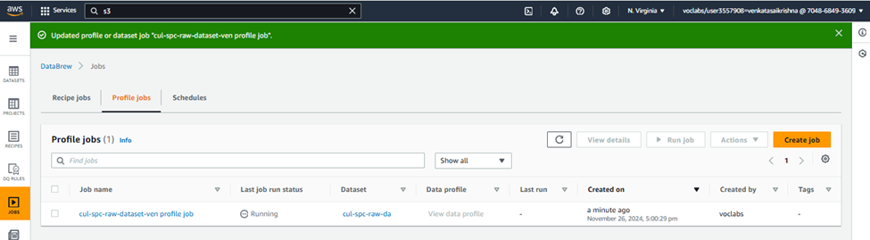
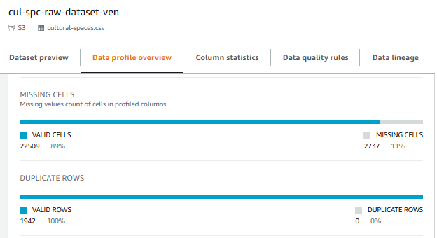
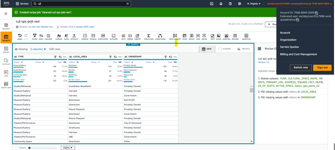
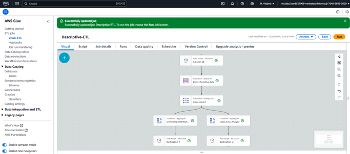

# Project-1: Data Analytics Platform Design and Implementation

## Exploratory Data Analysis

### Project Description
This project focuses on designing and implementing a **Data Analytics Platform (DAP)** to analyze cultural spaces in various local areas. The primary goals include:
- Identifying the number of cultural spaces in each local area.
- Calculating the percentage of cultural spaces by ownership type:
  - Privately Owned
  - Government-Owned
  - Non-Profit

The platform utilizes **AWS Services**, including **S3**, **Glue DataBrew**, and **Glue ETL**, to achieve efficient data storage, profiling, cleaning, and transformation.

---

### Methodology

#### **1. Data Ingestion**
The first step involves uploading the dataset to AWS S3 buckets:
- **Bucket 1:** `cul-spc-raw-ven` for storing raw data.
- **Bucket 2:** `cul-spc-trf-ven` for storing transformed data, organized into subfolders like:
  - `data-profiling`
  - `data-cleaning`
  - `data-quality`

These structured buckets ensure proper data organization and accessibility.

  
*Screenshot of storage buckets in AWS Console.*

---

#### **2. Data Profiling**
AWS DataBrew simplifies profiling by:
- Connecting directly to the raw dataset.
- Running profiling jobs to identify:
  - Missing values
  - Correlations
  - Invalid data
  - Overall data quality

Key insights from the profiling include:
- **Missing Data:** Approximately 11% missing values in some columns.
- **Key Columns for Analysis:** Type, Location, and Ownership.

  
*Connection of the raw dataset in AWS DataBrew.*

  
*Analysis of missing values in the dataset.*

---

#### **3. Data Cleaning**
The cleaning phase involves:
- Removing irrelevant columns while retaining critical data.
- Addressing missing values (<1% in "Location" and "Ownership").
- Organizing cleaned data into:
  - `system-folder` (Parquet format)
  - `user-folder` (CSV format)

  
*Final cleaned dataset in AWS DataBrew.*

---

#### **4. Data Pipeline Design**
An **AWS Glue ETL pipeline** was built to:
- Transform the cleaned dataset.
- Group data by location and analyze:
  - Ownership distribution (Private, Government, Non-Profit).
  - Concentration of cultural spaces in each local area.

  
*AWS Glue ETL pipeline for transformations.*

---

### Tools and Technologies
- **AWS Services:**
  - S3: For data storage.
  - Glue DataBrew: For data profiling and cleaning.
  - Glue ETL: For data transformation.
- **Programming Language:**
  - SQL: For querying datasets.
- **Others:**
  - AWS Console for management and visualization.

---

### Deliverables
1. **Ownership Distribution Analysis:**  
   Insights into ownership percentages (Private, Government, Non-Profit).  
     

2. **Local Area Analysis:**  
   Visualization of cultural spaces concentrated in each area.  
     

3. **ETL Pipeline:**  
   Efficient and repeatable workflow for future datasets.  
     

---

### Conclusion
This Data Analytics Platform efficiently manages cultural space data, providing actionable insights into ownership and geographic distribution. The modular design and use of AWS services ensure scalability, reliability, and performance for future analyses.

---
