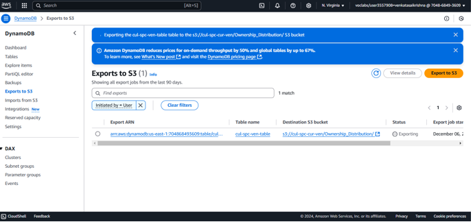
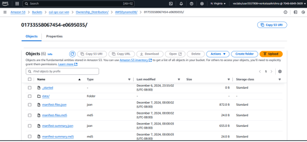
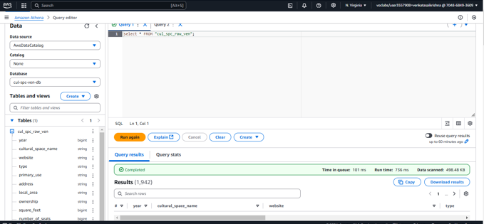
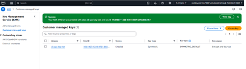
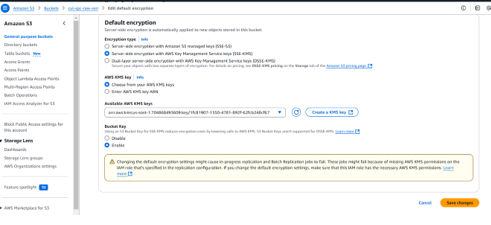
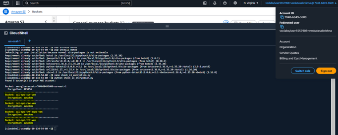

# DAP

##  Data Enriching
To prepare the data for analysis, I followed these steps:

1. **Created a DynamoDB Database**  
   - The database was scalable and flexible, capable of managing large volumes of data.
2. **Exported Data to S3**  
   - Exporting to S3 provided secure and cost-effective storage.
   - Enabled direct analytics using AWS tools like Glue and Athena.

  
*Screenshot from AWS Console.*  

  
*Screenshot from AWS Console.*  

3. **AWS Glue Crawler**  
   - Automatically inferred schema and populated the AWS Glue Data Catalog.
   - Ensured the data was query-ready for further analysis.

4. **Analyzed Data with AWS Athena**  
   - SQL queries were executed directly on the data stored in S3.
   - Ensured data integrity in terms of completeness, consistency, and uniqueness.

  
*Screenshot from AWS Console.*

---

##  Data Protection

### Encryption Techniques for Confidentiality
1. **AWS Key Management Service (KMS)**  
   - Created symmetric encryption keys for secure data encryption and decryption.
   - Integrated with other AWS services to ensure end-to-end encryption.

  
*Screenshot from AWS Console.*

2. **Bucket-Level Encryption**  
   - Applied to ensure sensitive information is only accessible to authorized users.

  
*Screenshot from AWS Console.*

3. **Status of Buckets**  
   - Verified encryption status for all buckets.

  
*Screenshot from AWS Console.*

### Integration by Means of Bucket Versioning
- **Purpose:** Maintain multiple versions of objects in S3 to enhance reliability and prevent accidental data loss.  
- **Benefits:**
  1. Data Recovery
  2. Audit Trail
  3. Protection Against Errors

  
*Screenshot from AWS Console.*

---

## Data Governance

1. **AWS Glue ETL Pipeline**  
   - Ensured data quality by safeguarding sensitive information and organizing processed data.

2. **Sensitive Data Detection**  
   - Verified that no Personally Identifiable Information (PII) was present.

  
*Screenshot from AWS Console.*

3. **Data Quality Evaluation**  
   - Assessed columns for completeness and identified areas with square footage greater than 10,000.

  
*Screenshot from AWS Console.*

---

## Data Observability

1. **Implemented AWS CloudWatch**  
   - Monitored data health, quality, and flow.  
   - Developed dashboards to track key metrics, detect anomalies, and manage costs.

  
*Screenshot from AWS Console.*

---

## Conclusion
This project successfully designed and implemented a robust Data Analytics Platform. The use of AWS services ensured efficient data storage, protection, governance, and observability, delivering high-quality insights and enabling decision-making.
