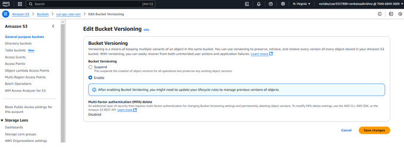
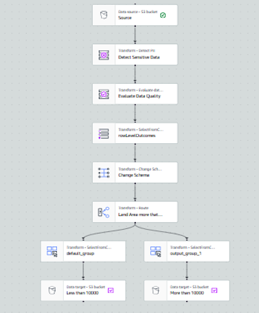
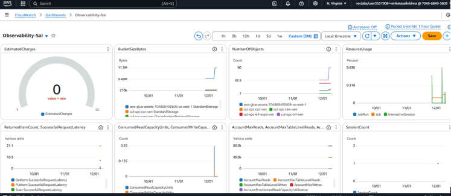

# Data Quality Control  

## Project Description:  
This project focuses on implementing a comprehensive **Data Quality Control (DQC)** framework using the dataset containing public art installation details. The initiative aims to ensure data integrity by addressing key aspects such as sensitivity, accuracy, consistency, completeness, and reliability. By improving the quality of this dataset, we can enhance its usability and provide accurate insights for analysis and decision-making.

---

## Project Title:  
Data Quality Evaluation and Control for Public Art Installations  

---

## Objective:  
To ensure the quality and reliability of the public art dataset by identifying sensitive data, evaluating its structure, and implementing data validation, profiling, and cleansing measures.  

---

## Background:  
The public art dataset includes information such as the title of the work, material used, neighborhood, and year of installation. While this dataset provides valuable insights, it contains inconsistencies, missing data, and possible inaccuracies. This project will establish a robust process for evaluating and improving the dataset's quality without being tied to an enterprise-specific implementation.

---

## Scope:  
This project focuses on:  
- **Data Profiling:** Assessing the quality of the dataset.  
- **Data Sensitivity Analysis:** Identifying and securing sensitive information.  
- **Data Cleansing:** Addressing inaccuracies and missing or duplicate values.  
- **Validation Rules:** Establishing guidelines to ensure consistent and accurate data entry.  

---

## Methodology:  

### **1. Current State Assessment**  
- Analyze the dataset structure and identify existing data quality challenges.  
- Pinpoint critical fields such as `Title of Work`, `Material Used`, and `Year of Installation` that impact analysis.
  
### **2. Data Profiling**  
- Use profiling tools to evaluate the dataset's completeness, accuracy, and consistency.  
- Identify sensitive fields and assess their potential impact on analysis and privacy compliance.  

  

### **3. Sensitivity Analysis**  
- Implement methods to identify sensitive data fields that may require masking or secure storage.  
- Document findings and recommendations for safeguarding sensitive data.  

### **4. Data Cleansing Processes**  
- Perform the following cleaning tasks:  
  - Remove duplicate records.  
  - Fill missing values with suitable imputations (e.g., "Unknown Material" for the `Material Used` field).  
  - Standardize formats for key columns (e.g., consistent `Year` format).  

### **5. Data Validation Rules**  
- Set validation rules to ensure:  
  - Data completeness (e.g., all records must have a `Title of Work`).  
  - Consistency (e.g., the `Year of Installation` should not be a future year).  
- Create guidelines for future data entries to minimize inaccuracies. 

### 6. Data Governance
- **ETL Pipeline**: Built using AWS Glue to ensure data quality and organize processed data into designated folders.  
- **Sensitive Data Detection**: Verified the dataset to ensure compliance with data protection standards.

  

### 7. Data Observability
- **CloudWatch Monitoring**: Created dashboards for key metrics, anomaly detection, and cost management.

  

---

## Deliverables:
1. Cleaned and validated datasets, ready for analysis.
2. Data profiling reports highlighting data quality insights.
3. ETL pipelines for repeatable data processing.
4. Dashboards for real-time data observability and cost tracking.

---

## Timeline:
The project timeline is divided into the following phases:
1. **Week 1-2**: Data ingestion and profiling.
2. **Week 3-4**: Data cleaning and enrichment.
3. **Week 5-6**: ETL pipeline design and implementation.
4. **Week 7**: Data governance and observability setup.
5. **Week 8**: Final review and deliverable submission.

